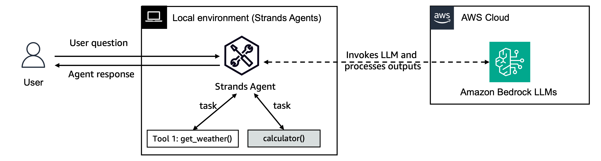
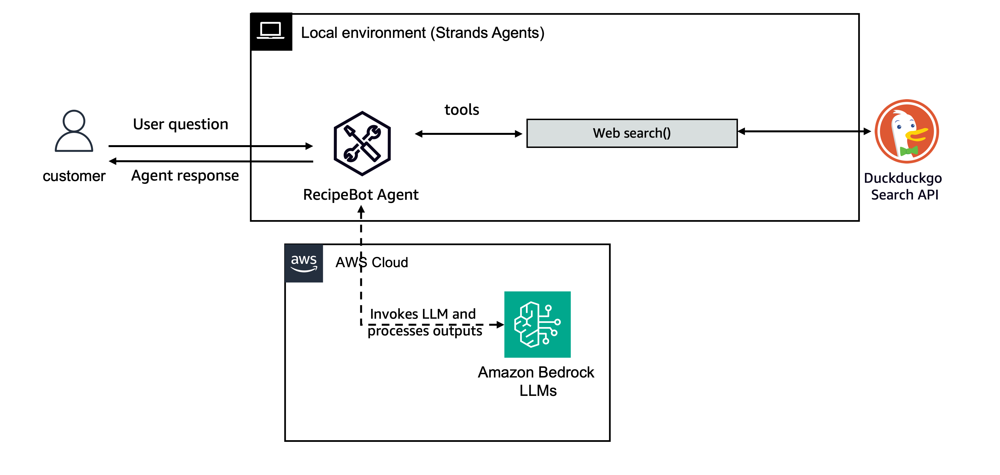

# Strands Agents 시작하기

이 가이드는 Strands Agents의 기본 개념을 이해하고 첫 번째 에이전트를 실행하는 데 도움을 줍니다.

## 사전 요구사항

- Python 3.10 이상
- 적절한 권한으로 구성된 AWS 계정
- Python 프로그래밍에 대한 기본 이해

## 설치

pip를 사용하여 Strands Agents 및 도구 패키지를 설치합니다:

```bash
pip install strands-agents strands-agents-tools
```

## 기본 개념

Strands Agents는 AWS 서비스와 상호 작용하고 복잡한 작업을 수행할 수 있는 AI 에이전트를 구축하기 위한 프레임워크입니다. 핵심 구성 요소는 다음과 같습니다:

1. **Agent**: 대화를 관리하고 도구를 조율하는 핵심 구성 요소
2. **Model**: 에이전트를 구동하는 기본 LLM(대규모 언어 모델)
3. **Tools**: 에이전트가 특정 작업을 수행하는 데 사용할 수 있는 함수
4. **Sessions and State**: 상호 작용 간 대화 기록 및 에이전트 상태를 유지하는 메커니즘
5. **Agent Loop**: 에이전트가 입력을 받고, 처리하고, 응답을 생성하는 프로세스 흐름
6. **Context Management**: 에이전트가 메모리 및 검색을 포함한 대화 컨텍스트를 유지하고 관리하는 방법

## 빠른 시작 가이드

이 디렉토리의 `01-first-agent.ipynb` 노트북은 다음에 대한 코드 예제가 포함된 포괄적인 가이드를 제공합니다:

1. **간단한 에이전트 만들기**: 시스템 프롬프트로 기본 에이전트를 초기화하는 방법 학습
2. **도구 추가**: 내장 및 사용자 정의 도구로 에이전트를 향상시키는 방법 발견
3. **로깅 구성**: 디버깅 및 모니터링을 위한 적절한 로깅 설정
4. **에이전트 사용자 정의**: 다양한 모델 선택 및 매개변수 구성

## 예제 실행

이 폴더에는 시작하는 데 도움이 되는 시작 노트북과 간단한 사용 사례가 포함되어 있습니다:

1. **01-first-agent.ipynb**: 포괄적인 빠른 시작 가이드 및 사용 사례가 포함된 Jupyter 노트북입니다.
여기서 다음을 구축합니다:


그리고 레시피 에이전트:




2. **02-simple-interactive-usecase/**: CLI를 통해 실행할 간단한 대화형 요리/레시피 에이전트가 포함된 디렉토리입니다.


대화형 에이전트를 실행하려면:

1. 디렉토리로 이동: `cd 02-simple-interactive-usecase`
2. 요구 사항 설치: `pip install -r requirements.txt`
3. 스크립트 실행: `python recipe_bot.py`

## 리소스

- 더 자세한 가이드는 [Strands 문서](https://strandsagents.com/latest/user-guide/quickstart/)를 참조하세요
- [Sessions and State](https://strandsagents.com/latest/user-guide/concepts/agents/sessions-state)에 대해 자세히 알아보세요
- [Agent Loop](https://strandsagents.com/latest/user-guide/concepts/agents/agent-loop/)를 이해하세요
- [Context Management](https://strandsagents.com/latest/user-guide/concepts/agents/context-management/)에 대해 자세히 알아보세요
- 미리 구현된 도구는 [strands-agents-tools](https://github.com/strands-agents/tools) 저장소를 확인하세요
- 시스템 프롬프트를 사용자 정의하고 관련 도구를 추가하여 작업별 에이전트를 직접 구축해 보세요

Strands Agents로 즐거운 개발 되세요! 🚀
